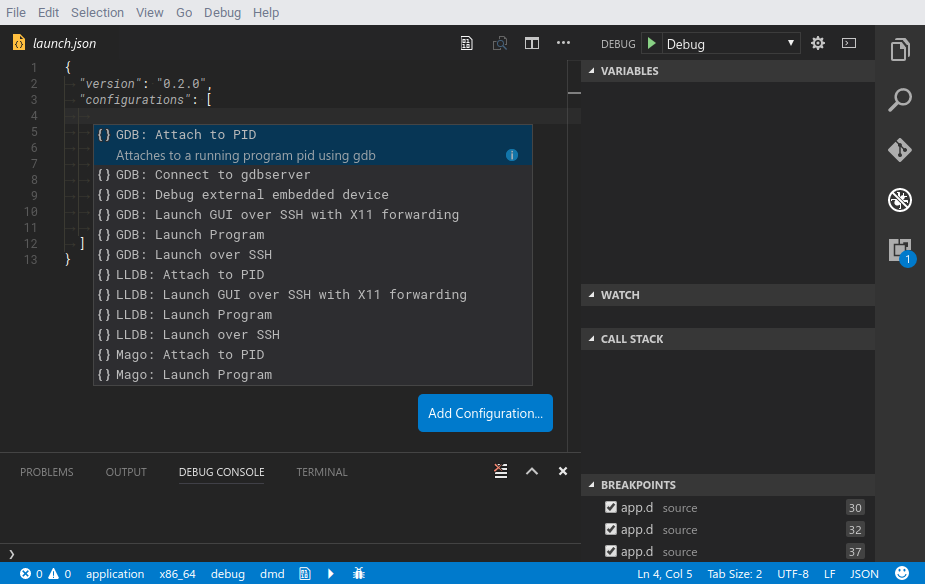

# Debug

Native VSCode debugger. Supports both GDB and LLDB.

## Installation

Press ctrl-p (cmd+p on OS X) and run `ext install webfreak.debug` in visual studio code and install GDB/LLDB. See `Usage` for details on how to set it up.


## Usage


Or if you already have an existing debugger in your project setup you can click "Create Configuration" or use the auto completion instead:



Open your project and click the debug button in your sidebar. At the top right press
the little gear icon and select GDB or LLDB. It will automatically generate the configuration
you need.

*Note: for LLDB you need to have `lldb-mi` in your PATH*

If you are on OS X you can add `lldb-mi` to your path using
`ln -s /Applications/Xcode.app/Contents/Developer/usr/bin/lldb-mi /usr/local/bin/lldb-mi` if you have Xcode.


Now you need to change `target` to the application you want to debug relative
to the cwd. (Which is the workspace root by default)

Additionally you can set `terminal` if you want to run the program in a separate terminal with
support for input. On Windows set it to an empty string (`""`) to enable this feature. On linux
set it to an empty string (`""`) to use the default terminal emulator specified with `x-terminal-emulator`
or specify a custom one. Note that it must support the `-e` argument.

Before debugging you need to compile your application first, then you can run it using
the green start button in the debug sidebar. For this you could use the `preLaunchTask`
argument vscode allows you to do. Debugging multithreaded applications is currently not
implemented. Adding breakpoints while the program runs will not interrupt it immediately.
For that you need to pause & resume the program once first. However adding breakpoints
while its paused works as expected.

Extending variables is very limited as it does not support child values of variables.
Watching expressions works partially but the result does not get properly parsed and
it shows the raw output of the command. It will run `data-evaluate-expression`
to check for variables.

While running you will get a console where you can manually type GDB/LLDB commands or MI
commands prepended with a hyphen `-`. The console shows all output separated
in `stdout` for the application, `stderr` for errors and `log` for log messages.

Some exceptions/signals like segmentation faults will be catched and displayed but
it does not support for example most D exceptions.

### Attaching to existing processes

Attaching to existing processes currently only works by specifying the PID in the
`launch.json` and setting `request` to `"attach"`. You also need to specify the executable
path for the debugger to find the debug symbols.

```
"request": "attach",
"executable": "./bin/executable",
"target": "4285"
```

This will attach to PID 4285 which should already run. GDB will pause the program on entering and LLDB will keep it running.

### Using `gdbserver` for remote debugging (GDB only)

You can also connect to a gdbserver instance and debug using that. For that modify the
`launch.json` by setting `request` to `"attach"` and `remote` to `true` and specifing the
port and optionally hostname in `target`.

```
"request": "attach",
"executable": "./bin/executable",
"target": ":2345",
"remote": true
```

This will attach to the running process managed by gdbserver on localhost:2345. You might
need to hit the start button in the debug bar at the top first to start the program.


## [Issues](https://github.com/WebFreak001/code-debug)
