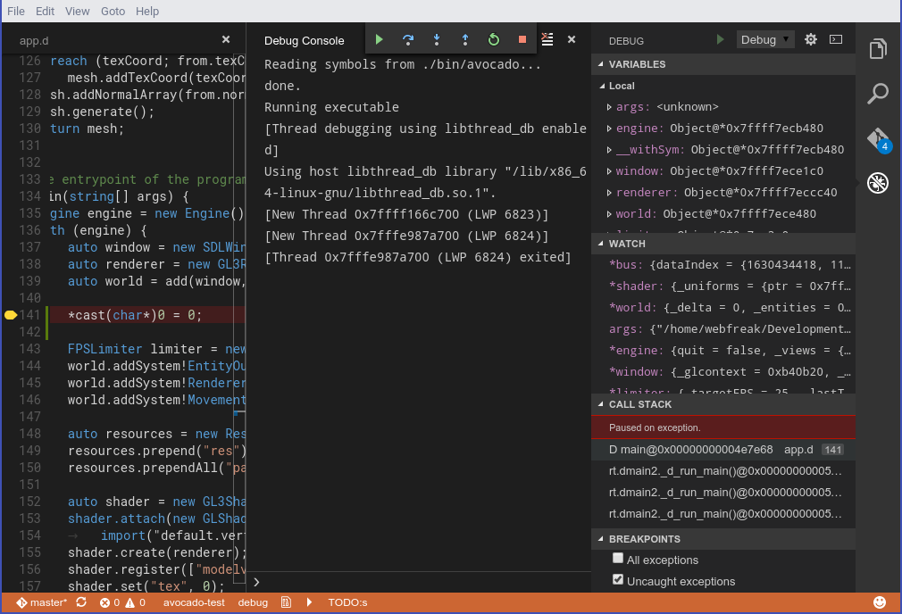
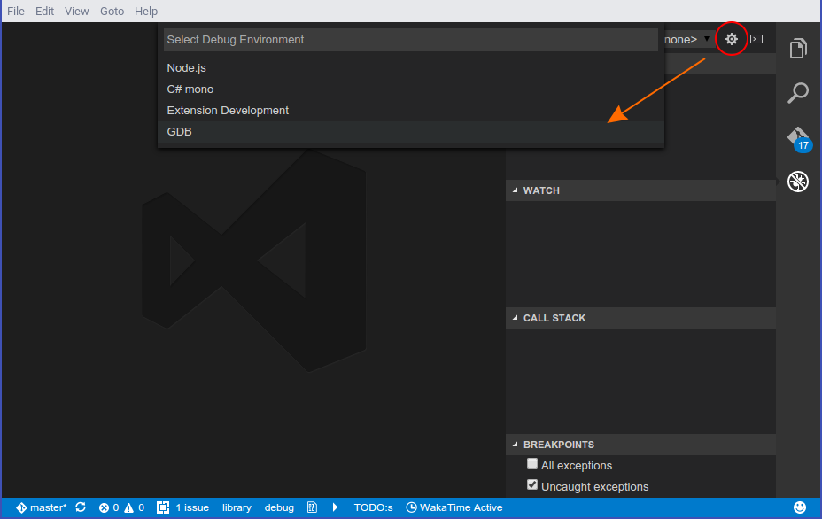
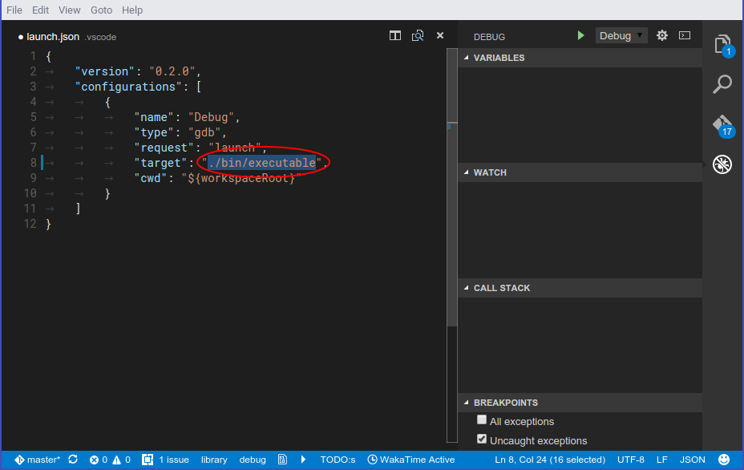

# Debug

Native VSCode debugger. Currently only using GDB.

## Installation

Run `ext install debug` (Ctrl-Shift-P -> install extension + make sure its just called `Debug` and at the right it should say `webfreak`) in visual studio code and install GDB and add the executable to your PATH variable. If you have changed your PATH, don't forget to restart vscode. Then follow the usage tutorial below.



## Usage



Open your project and click the debug button in your sidebar. At the top right press
the little gear icon and select GDB. It will automatically generate the configuration
you need.



Now you need to change `target` to the application you want to debug relative
to the cwd. (Which is the workspace root by default)

Additionally you can set `terminal` if you want to run the program in a separate terminal with
support for input. On Windows set it to an empty string (`""`) to enable this feature. On linux
set it to an empty string (`""`) to use the default terminal emulator specified with `x-terminal-emulator`
or specify a custom one. Note that it must support the `-e` argument.

Before debugging you need to compile your application first, then you can run it using
the green start button in the debug sidebar. For this you could use the `preLaunchTask`
argument vscode allows you to do. Debugging multithreaded applications is currently not
implemented. Adding breakpoints while the program runs will not interrupt it immediately.
For that you need to pause & resume the program once first. However adding breakpoints
while its paused works as expected.

Extending variables is very limited as it does not support child values of variables.
Watching expressions works partially but the result does not get properly parsed and
it shows the raw GDB output of the command. It will run `data-evaluate-expression`
to check for variables.

While running you will get a console where you can manually type GDB commands or GDB/MI
commands prepended with a hyphen `-`. The console shows all output GDB gives separated
in `stdout` for the application, `stderr` for errors and `log` for GDB log messages.

Some exceptions/signals like segmentation faults will be catched and displayed but
it does not support for example most D exceptions.

### Attaching to existing processes

Attaching to existing processes currently only works by specifying the PID in the
`launch.json` and setting `request` to `"attach"`. You also need to specify the executable
path for GDB to find the debug symbols.

```
"request": "attach",
"executable": "./bin/executable",
"target": "4285"
```

This will attach to PID 4285 which should already run. GDB will pause the program on entering.

### Using `gdbserver` for remote debugging

You can also connect to a gdbserver instance and debug using that. For that modify the
`launch.json` by setting `request` to `"attach"` and `remote` to `true` and specifing the
port and optionally hostname in `target`.

```
"request": "attach",
"executable": "./bin/executable",
"target": ":2345",
"remote": true
```

This will attach to the running process managed by gdbserver on localhost:2345. You might
need to hit the start button in the debug bar at the top first to start the program.

### Using ssh for remote debugging

Debugging using ssh automatically converts all paths between client & server and also optionally
redirects X11 output from the server to the client. Simply add a `ssh` object in your `launch`
request.

```
"request": "launch",
"target": "./executable",
"cwd": "${workspaceRoot}",
"ssh": {
	"forwardX11": true,
	"host": "192.168.178.57",
	"cwd": "/home/remoteUser/project/",
	"keyfile": "/path/to/.ssh/key", // OR
	"password": "password123",
	"user": "remoteUser",
	"x11host": "localhost",
	"x11port": 6000,
	// Optional, content will be executed on the SSH host before the debugger call.
	"bootstrap": "source /home/remoteUser/some-env"
}
```

`cwd` will be used to trim off local paths and `ssh.cwd` will map them to the server. This is
required for basically everything except watched variables or user commands to work.

For X11 forwarding to work you first need to enable it in your Display Manager and allow the
connections. To allow connections you can either add an entry for applications or run `xhost +`
in the console while you are debugging and turn it off again when you are done using `xhost -`.

Because some builds requires one or more environment files to be sourced before running any
command, you can use the `ssh.bootstrap` option to add some extra commands which will be prepended
to the debugger call (using `&&` to join both).

## [Issues](https://github.com/WebFreak001/code-debug)
