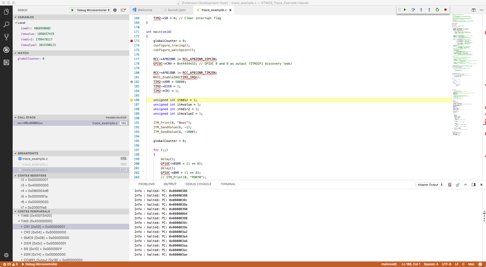

# Cortex Debug



Debugging support for ARM Cortex-M Microcontrollers with the following features:

* Support J-Link, OpenOCD GDB Server, STMicroelectronic's ST-LINK GDB server (no SWO support yet), pyOCD
* Initial support for the Black Magic Probe (This has not been as heavily tested; SWO can only be captured via a serial port)
* Partial support textane/stlink (st-util) GDB Servers (SWO can only be captured via a serial port)
* Experimental (since V1.2): Multi-core and multi-session debugging. See https://github.com/Marus/cortex-debug/wiki/Multi-core-debugging
* Experimental (since V1.2): Disassembly of source code available along with instruction level breakpoints and stepping. See https://github.com/Marus/cortex-debug/wiki/Disassembly-Debugging
* Cortex Core Register Viewer (integrated into Variables window since V1.2)
    * In some cases the st-util GDB server can report incomplete/incorrect registers, so there may be some issues here.
* SWO Decoding - "console" text output and binary data (signed and unsigned 32-bit integers, Q16.16 fixed point integers, single precision floating point values)
    * The registers that are part of the DWT, TPIU, and ITM debug components will automatically be configured and do not need to be set in firmware.
    * Firmware may still need to enable the SWO output pin - as this part of the setup is microcontroller dependant.
    * Decoding ETM data over the SWO pin is not currently supported.
* Live graphing of decoded ITM data.
* Support for Custom ITM Data Decoders:
    * Ability to define JavaScript modules to decode complex data formats streamed over one or more ITM ports. Data can be printed to a output window, or sent to the graphing system.
* Initial Semihosting Support
* Support for SEGGER Real Time Trace (RTT) using OpenOCD and J-Link gdb-servers. All the features supported for SWO (text, binary, graphing) are also supported with RTT.
* Ability to view and step through the disassembled binary. There are three ways that disassembled code will be shown:
    * Disassembly code will automatically be shown if it cannot locate the corresponding source code.
    * You can manually see the disassembly for a particular function (`Cortex-Debug: View Disassembly (Function)` command)
    * You can set the debugger to always show show disassembly (`Cortex-Debug: Set Force Disassembly` command)
* Globals and Static scopes in the variables view
* Initial support for Rust code (most functionality is working; disassembly views and variables view may still have issues)
* RTOS Thread Support in `CALL STACK` window (J-Link, OpenOCD, pyOCD - RTOS supported depend on GDB server)
    * As a general rule do not try to use stepping instructions before the scheduler of your RTOS has started - in many cases this tends to crash the GDB servers or leave it in an inconsistent state.
* Live Watch with supported GDB servers (tested with OpenOCD, J-Link, STLink so far - since V1.6)
* We have a set of extensions that this extension relies on for various frontend services (since V1.6)
  * These services are under the mcu-debug organization and lot of that content was re-factored from this extension to make them work with other debuggers and with browsers
  * Visit https://marketplace.visualstudio.com/search?term=mcu-debug&target=VSCode&category=All%20categories&sortBy=Relevance\
  * Highlights are a Memory Viewer, Peripheral (SVD) Viewer, RTOS viewer
  * These extensions are considered as dependency of this extension and VSCode should help you install all of them. We will consider make an `Extension Pack` in the future

### Release Versioning
Cortex-Debug uses a [versioning system specified by Microsoft](https://code.visualstudio.com/updates/v1_63#_pre-release-extensions) that allows distribution of pre-releases via the marketplace. You can enable (or disable) pre-releases within VSCode for this extension and you will automatically get new pre-releases. By default, pre-releases are disabled. We use pre-releases as allow testing of bug fixes and new features. They allow you participate during the formation of a feature of how an issue gets addressed. [More info about pre-releases](https://code.visualstudio.com/api/working-with-extensions/publishing-extension#prerelease-extensions). To summarize, extensions use [semantic versioning (SemVer)](https://semver.org/) system which in simple terms is `major.minor.patch`. With MS convention, if the `minor` version is `ODD`, then it is a pre-release.

### Planned Features
* Additional Graphing Options
* Enhanced SVD Auto-selection
* [Our TODO file](https://github.com/Marus/cortex-debug/blob/master/TODO.md)

## Installation

Requirements:

* ARM GCC Toolchain (https://developer.arm.com/open-source/gnu-toolchain/gnu-rm/downloads) - provides arm-none-eabi-gdb and related tools
* At least one of:
    * J-Link Software Tools - provides the J-Link GDB Server for J-Link based debuggers (https://www.segger.com/downloads/jlink)
    * OpenOCD - provides a GDB Server that can be used with a number of debuggers (http://openocd.org)
        * NOTE: On macOS do not use the default version of OpenOCD provided by homebrew, this is not compatible with releases V0.2.4 and newer. You can either install from source using homebrew (`brew install open-ocd --HEAD`) or the packages from https://github.com/gnu-mcu-eclipse/openocd/releases will also work. Some linux versions and Windows may also need a more up-to-date version of OpenOCD from the gnu-mcu-eclipse releases.
    * Texane's st-util GDB server - Only supports ST-Link Debug Probes (https://github.com/texane/stlink)
    * ST-LINK GDB server - This server is packaged with the [STM32CubeIDE](https://www.st.com/en/development-tools/stm32cubeide.html) which must be installed. The location of the STM32CubeIDE and related tools is automatically resolved but also can be overridden using configuration settings (`armToolchainPath`, `stm32cubeprogrammer` and `serverpath`).
    * pyOCD GDB Server - GDB server that supports the CMSIS-DAP debugger on a number of mbed boards (https://github.com/mbedmicro/pyOCD)
    * Black Magic Probe

## Usage

See https://github.com/Marus/cortex-debug/wiki for usage information. This needs some help from the community. See https://github.com/Marus/cortex-debug/blob/master/debug_attributes.md for a summary of all properties that are available in your `launch.json`

## How to Build from sources
* `git clone https://github.com/Marus/cortex-debug.git`
* `cd cortex-debug`
* Optionally switch to a branch: `git checkout <existing-branch-name>`
* `npm install`
* Optional `npm run compile`
* Open VSCode in the top folder and run the task `npm watch`. This will compile the code and watch for any changes and auto compile. The first time, it may take a minute or so for it to watch the entire folder. You can see the output of `npm watch` in the Terminal tab.

## How to debug
The extension is split into two main parts.
1) The front-end which is what you interact with mostly
2) The backend called `debug adapter` which interfaces between `gdb`, `vscode/front-end`, and the `gdb-server`. We just start the server and from then on the debug adapter only interacts with `gdb`. All requests go to `gdb` and the results are read back from `gdb` using `gdb`'s MI (machine interface)

If you want to debug both parts, in `launch.json` use the `Extension + Debug Server` configuration. It will launch a new window -- the `debuggee`. In the `debuggee` VSCode window, load a FW folder/workspace (VSCode remembers the last one) and add the following to `debuggee`'s `launch.json`.
```
            "debugServer": 4711
```
Now, launch a debug session and you wil be able to use the primary VSCode window to observe the Cortex-Debug extension

## Acknowledgments

Parts of this extension are based upon Jan Jurzitza's (WebFreak) code-debug extension (https://github.com/WebFreak001/code-debug).<br>
His project provided an excellent base for GDB MI parsing and interaction.
