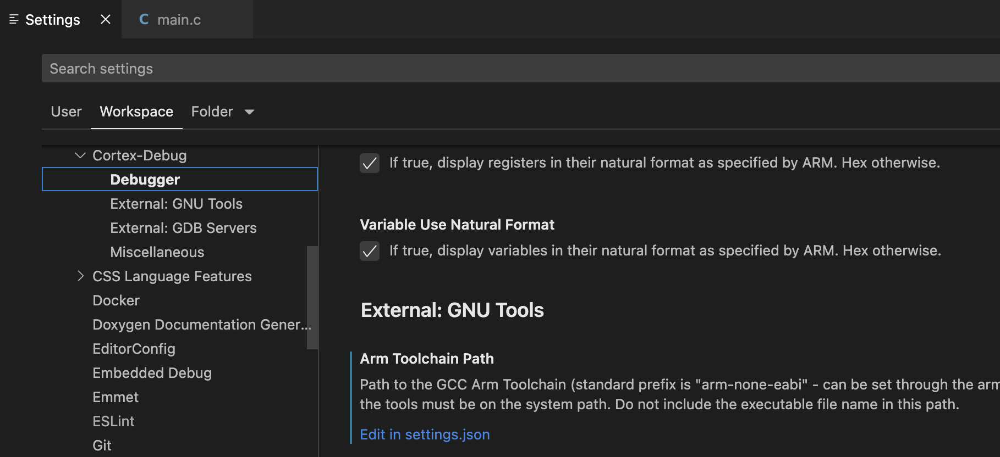

There are many `User/Workspace Settings` to control things globally. You can find these in the VSCode Settings UI. `launch.json` can override some of those settings. There is a lot of functionality that is available via `Settings` and some may be useful in a team environment and/or can be used across all cortex-debug sessions

The following attributes (properties) can be used in your `launch.json` to control various aspects of debugging. Also `IntelliSense` is an invaluable aid while editing `launch.json`. With `IntelliSense`, you can hover over an attribute to get more information and/or help you find attributes (just start typing a double-quote, use Tab key) and provide defaults/options.

If the type is marked as `{...}` it means that it is a complex item can have multiple types. Possibly consult our Wiki
| Attribute | Type | Applies To | Description |
| --------- | ---- | ---------- | ----------- |
| BMPGDBSerialPort | string | Common | The serial port for the Black Magic Probe GDB Server. On Windows this will be "COM<num>", on Linux this will be something similar to /dev/ttyACM0, on OS X something like /dev/cu.usbmodemE2C0C4C6 (do not use tty versions on OS X) |
| armToolchainPath | string | Common | This setting can be used to override the armToolchainPath user setting for a particular launch configuration. This should be the path where arm-none-eabi-gdb, arm-none-eabi-objdump and arm-none-eabi-nm are located. |
| boardId | string | Common | PyOCD Board Identifier. Needed if multiple compatible boards are connected. |
| breakAfterReset | boolean | Common | Applies to Restart/Reset/Launch, halt debugger after a reset. Ignored if `runToEntryPoint` is used. |
| chainedConfigurations | object | Common | An object describing how additional configurations should be launched |
| chainedConfigurations.delayMs | number | Common | Default delay in milliseconds for a certain amount of milliseconds to begin launch. Inherited by children |
| chainedConfigurations.detached | boolean | Common | Related or independent server sessions. Set to true for servers like 'JLink'. Inherited by children |
| chainedConfigurations.enabled | boolean | Common | Enable/Disable entire set of chained configurations |
| chainedConfigurations.inherits | string[] | Common | List of properties to inherit from parent. Sorry, no IntelliSense |
| chainedConfigurations.launches | object[] | Common | undefined |
| chainedConfigurations.lifecycleManagedByParent | boolean | Common | Are Restart/Reset/Stop/Disconnect shared? All life-cycle management done as a group by parent/root. Inherited by children |
| chainedConfigurations.overrides | object | Common | Values to override/set in this child configuration. A set of name/value pairs. Set value to 'null' (no quotes) to delete. Sorry, no IntelliSense |
| chainedConfigurations.waitOnEvent | string | Common | Event to wait for. 'postStart' means wait for gdb-server connecting, 'postInit' is after init commands are completed by gdb. Inherited by children |
| cmsisPack | string | Common | Path to a CMSIS-Pack file. Use to add extra device support. |
| configFiles | string[] | Common | OpenOCD/PE GDB Server configuration file(s) to use when debugging (OpenOCD -f option) |
| cpu | string | Common | CPU Type Selection - used for QEMU server type |
| ctiOpenOCDConfig | object | Launch | Experimental. Does not work yet |
| ctiOpenOCDConfig.enabled | boolean | Launch | Enable/Disable Cross Trigger Interface/Matrix for synchronized pause/resume |
| ctiOpenOCDConfig.initCommands | string[] | Launch | List of OpenOCD TCL commands to initialize the CTI/CTM infrastructure (if any) |
| ctiOpenOCDConfig.pauseCommands | string[] | Launch | List of OpenOCD TCL commands to pause all processors |
| ctiOpenOCDConfig.resumeCommands | string[] | Launch | List of OpenOCD TCL commands to resume all processors |
| cwd | string | Common | Directory to run commands from |
| debuggerArgs | array | Common | Additional arguments to pass to GDB command line |
| device | string | Common | Target Device Identifier |
| executable | string | Common | Path of executable for symbols and program information. See also `loadFiles`, `symbolFiles` |
| gdbPath | string | Common | This setting can be used to override the GDB path user/workspace setting for a particular launch configuration. This should be the full pathname to the executable (or name of the executable if it is in your PATH). Note that other toolchain executables with the configured prefix must still be available. |
| gdbTarget | string | Common | For externally (servertype = "external") controlled GDB Servers you must specify the GDB target to connect to. This can either be a "hostname:port" combination or path to a serial port |
| graphConfig | {object} | Common | Description of how graphing can be done. See our Wiki for details |
| interface | string | Common | Debug Interface type to use for connections (defaults to SWD) - Used for J-Link, ST-LINK and BMP probes. |
| ipAddress | string | Common | IP Address for networked J-Link Adapter |
| jlinkscript | string | Common | J-Link script file - optional input file for customizing J-Link actions. |
| liveWatch | object | Common | An object with parameters for Live Watch |
| liveWatch.enabled | boolean | Common | Enable/Disable Live Watch. Only applies to OpenOCD |
| liveWatch.samplesPerSecond | number | Common | Maximum number of samples per second. Different from GUI refresh-rate, which is a user/workspace setting |
| loadFiles | string[] | Launch | List of files (hex/bin/elf files) to load/program instead of the executable file. Symbols are not loaded (see `symbolFiles`). Can be an empty list to specify none. If this property does not exist, then the executable is used to program the device |
| machine | string | Common | Machine Type Selection - used for QEMU server type |
| numberOfProcessors | number | Common | Number of processors/cores in the target device. |
| objdumpPath | string | Common | This setting can be used to override the objdump (used to find globals/statics) path user/workspace setting for a particular launch configuration. This should be the full pathname to the executable (or name of the executable if it is in your PATH). Note that other toolchain executables with the configured prefix must still be available. The program 'nm' is also expected alongside |
| openOCDLaunchCommands | string[] | Common | OpenOCD command(s) after configuration files are loaded (-c options) |
| openOCDPreConfigLaunchCommands | string[] | Common | OpenOCD command(s) before configuration files are loaded (-c options) |
| overrideAttachCommands | string[] | Attach | You can use this to property to override the commands that are normally executed as part of attaching to a running target. In most cases it is preferable to use preAttachCommands and postAttachCommands to customize the GDB attach sequence. |
| overrideGDBServerStartedRegex | string | Common | You can supply a regular expression (https://developer.mozilla.org/en-US/docs/Web/JavaScript/Guide/Regular_Expressions) in the configuration property to override the output from the GDB Server that is looked for to determine if the GDB Server has started. Under most circumstances this will not be necessary - but could be needed as a result of a change in the output of a GDB Server making it incompatible with cortex-debug. This property has no effect for bmp or external GDB Server types. |
| overrideLaunchCommands | string[] | Launch | You can use this to property to override the commands that are normally executed as part of flashing and launching the target. In most cases it is preferable to use preLaunchCommands and postLaunchCommands to customize the GDB launch sequence. |
| overrideResetCommands | string[] | Common | You can use this to property to override the commands that are normally executed as part of reset the target. When not defined this will have the same value of overrideRestartCommands. In most cases it is preferable to use preResetCommands and postResetCommands to customize the GDB reset sequence. |
| overrideRestartCommands | string[] | Common | You can use this to property to override the commands that are normally executed as part of restarting the target. In most cases it is preferable to use preRestartCommands and postRestartCommands to customize the GDB restart sequence. |
| postAttachCommands | string[] | Attach | Additional GDB Commands to be executed after the main attach sequence has finished. |
| postLaunchCommands | string[] | Launch | Additional GDB Commands to be executed after the main launch sequence has finished. |
| postResetCommands | string[] | Common | Additional GDB Commands to be executed at the end of the reset sequence. When not defined this will have the same value of postRestartCommands. |
| postRestartCommands | string[] | Common | Additional GDB Commands to be executed at the end of the restart sequence. |
| postRestartSessionCommands | string[] | Common | Additional GDB Commands to be executed at the end of the re-start sequence, after a debug session has already started. |
| postStartSessionCommands | string[] | Common | Additional GDB Commands to be executed at the end of the start sequence, after a debug session has already started and runToEntryPoint is not specified. |
| powerOverBMP | string | Common | Power up the board over Black Magic Probe. "powerOverBMP" : "enable" or "powerOverBMP" : "disable". If not set it will use the last power state. |
| preAttachCommands | string[] | Attach | Additional GDB Commands to be executed at the start of the main attach sequence (immediately after attaching to target). |
| preLaunchCommands | string[] | Launch | Additional GDB Commands to be executed at the start of the main launch sequence (immediately after attaching to target). |
| preResetCommands | string[] | Common | Additional GDB Commands to be executed at the beginning of the reset sequence (after interrupting execution). When not defined this will have the same value of preRestartCommands. |
| preRestartCommands | string[] | Common | Additional GDB Commands to be executed at the beginning of the restart sequence (after interrupting execution). |
| rtos | string | Common | RTOS being used. For JLink this can be Azure, ChibiOS, embOS, FreeRTOS, NuttX, Zephyr or the path to a custom JLink RTOS Plugin library. For OpenOCD this can be auto (recommended), FreeRTOS, ThreadX, chibios, Chromium-EC, eCos, embKernel, linux, mqx, nuttx, RIOT, uCOS-III, or Zephyr. |
| rttConfig | object | Common | SEGGER's Real Time Trace (RTT) and supported by JLink, OpenOCD and perhaps others in the future |
| rttConfig.address | string | Common | Address to start searching for the RTT control block. Use "auto" for Cortex-Debug to use the address from elf file |
| rttConfig.clearSearch | boolean | Common | When true, clears the search-string. Only applicable when address is "auto" |
| rttConfig.decoders | {object} | Common | SWO Decoder Configuration |
| rttConfig.enabled | boolean | Common | Enable/Disable RTT |
| rttConfig.polling_interval | number | Common | number of milliseconds (> 0) to wait for check for data on out channels. Only for OpenOCD |
| rttConfig.rtt_start_retry | number | Common | Keep trying to start RTT for OpenOCD until it succeeds with given internal in milliseconds. <= 0 means do not retry. Only for OpenOCD |
| rttConfig.searchId | string | Common | A string to search for to find the RTT control block. If 'address' is 'auto', use ONLY if you have a custom RTT implementation |
| rttConfig.searchSize | number | Common | Number of bytes to search for the RTT control block. If 'address' is 'auto', use ONLY if you have a custom RTT implementation |
| runToEntryPoint | string | Common | Applies to Launch/Restart/Reset, ignored for Attach. If enabled the debugger will run until the start of the given function. |
| searchDir | string[] | Common | OpenOCD directories to search for config files and scripts (-s option). If no search directories are specified, it defaults to the configured cwd. |
| serialNumber | string | Common | J-Link or ST-LINK Serial Number - only needed if multiple J-Links/ST-LINKs are connected to the computer |
| serverArgs | string[] | Common | Additional arguments to pass to GDB Server command line |
| serverpath | string | Common | This setting can be used to override the GDB Server path user/workspace setting for a particular launch configuration. It is the full pathname to the executable or name of executable if it is in your PATH |
| servertype | string | Common | GDB Server type - supported types are jlink, openocd, pyocd, pe, stlink, stutil, qemu, bmp and external |
| showDevDebugOutput | string | Common | Used to debug this extension. Prints all GDB responses to the console. 'raw' prints gdb responses, 'parsed' prints results after parsing, 'both' prints both. 'vscode' shows raw and VSCode interactions |
| showDevDebugTimestamps | boolean | Common | Show timestamps when 'showDevDebugOutput' is enabled |
| stlinkPath | string | Common | Path to the ST-LINK_gdbserver executable. If not set then ST-LINK_gdbserver (ST-LINK_gdbserver.exe on Windows) must be on the system path. |
| stm32cubeprogrammer | string | Common | This path is normally resolved to the installed STM32CubeIDE or STM32CubeProgrammer but can be overridden here. |
| svdFile | string | Common | This is for 'XPERIPHERALS' window provided by 'mcu-debug.peripheral-viewer'. It can be a simple file name or more based on a CMSIS pack or deviceName. See 'mcu-debug.peripheral-viewer' for format |
| svdPath | string | Common | This is for 'XPERIPHERALS' window provided by 'mcu-debug.peripheral-viewer' and 'Embedded Tools' Extension from Microsoft. It can be a simple file name. For 'mcu-debug.peripheral-viewer' or more based on a CMSIS pack or deviceName. See 'mcu-debug.peripheral-viewer' for format |
| swoConfig | object | Common | Description of SWO can be configured. Also see our Wiki for details |
| swoConfig.cpuFrequency | number | Common | Target CPU frequency in Hz. |
| swoConfig.decoders | {object} | Common | SWO Decoder Configuration |
| swoConfig.enabled | boolean | Common | Enable SWO decoding. |
| swoConfig.source | string | Common | Source for SWO data. Can either be "probe" to get directly from debug probe, or a serial port device to use a serial port external to the debug probe. |
| swoConfig.swoFrequency | number | Common | SWO frequency in Hz. |
| swoConfig.swoPath | string | Common | Path name when source is "file" or "serial". Typically a /path-name or a serial-port-name |
| swoConfig.swoPort | string | Common | When server is "external" && source is "socket", port to connect to. Format [host:]port |
| symbolFiles | object[] | Common | List of ELF files to load symbols from instead of the executable file. Program information is ignored (see `loadFiles`). Can be an empty list to specify none. If this property does not exist, then the executable is used for symbols |
| targetId | {string &#124; number} | Common | On BMP this is the ID number that should be passed to the attach command (defaults to 1); for PyOCD this is the target identifier (only needed for custom hardware) |
| targetProcessor | number | Common | The processor you want to debug. Zero based integer index. Must be less than 'numberOfProcessors' |
| toolchainPrefix | string | Common | This setting can be used to override the toolchainPrefix user setting for a particular launch configuration. Default = "arm-none-eabi" |
| v1 | boolean | Common | For st-util only. Set this to true if your debug probe is a ST-Link V1 (for example, the ST-Link on the STM32 VL Discovery is a V1 device). When set to false a ST-Link V2 device is used. |
